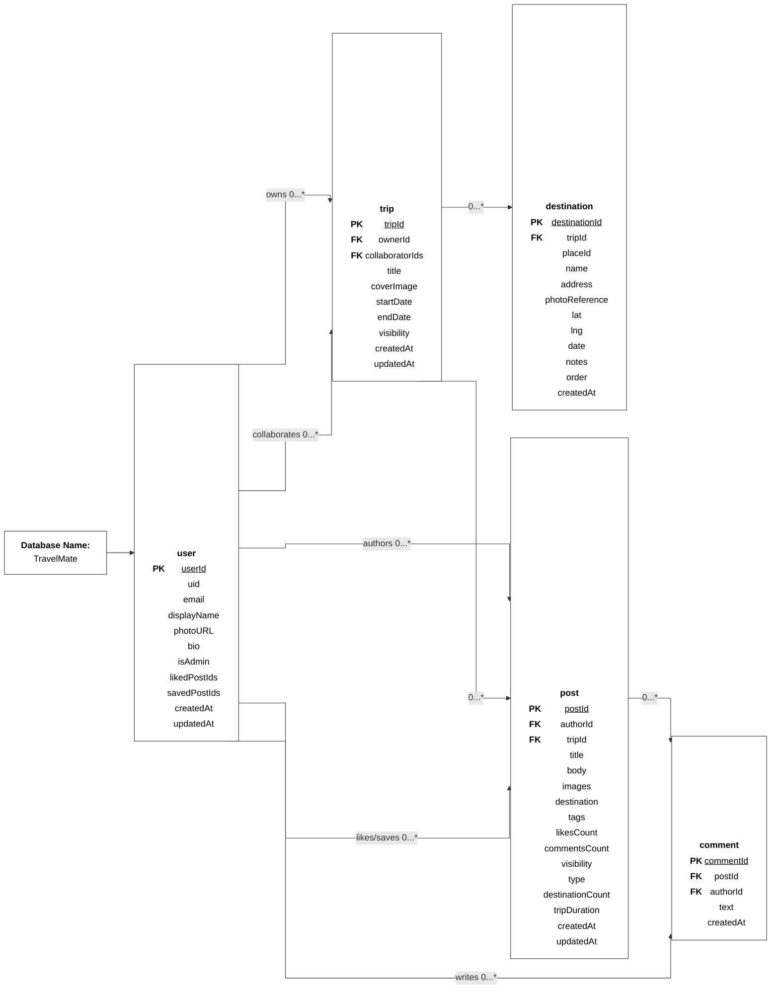

# TravelMate ERD

SVG version: [erd.svg](./erd.svg)

## Relationship Labels

| Relationship | Meaning |
| --- | --- |
| `user owns 0...* trip` | A user may own zero or more trips. |
| `user collaborates 0...* trip` | A user may collaborate on zero or more trips. |
| `trip 0...* destination` | A trip may contain zero or more destinations. |
| `user authors 0...* post` | A user may author zero or more posts. |
| `trip 0...* post` | A trip may be published as zero or more shared-itinerary posts. |
| `post 0...* comment` | A post may have zero or more comments. |
| `user 0...* comment` | A user may write zero or more comments. |
| `user 0...* post` | A user may like or save zero or more posts through `likedPostIds` and `savedPostIds`. |
